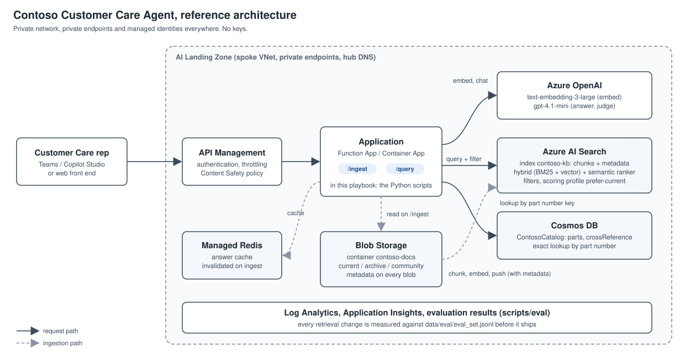
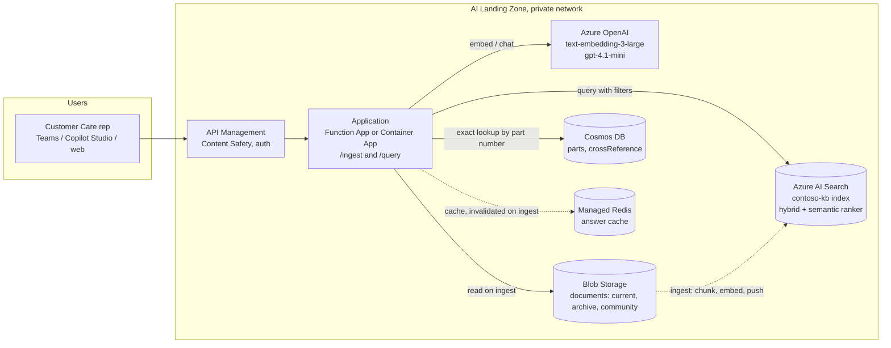

# RAG Search Tuning Playbook

A hands-on playbook for making a retrieval-augmented (RAG) customer care assistant **accurate and timely** on Azure, using Azure AI Search, Azure OpenAI, Blob Storage and Cosmos DB inside a private network.

It is built around a fictional company, Contoso Water Solutions, whose problems are the ones most product-heavy companies hit in their first RAG deployment: part numbers that look alike, spec tables that get cut in half, archived documents that still answer questions, and no way to prove that a change made things better.

Every module has a **before** and an **after** you can run from the terminal in a few minutes, and everything is scripted so the demo can be reset and repeated.



## The story: Contoso Water Solutions

Contoso Water Solutions makes commercial plumbing products under three brands:

| Brand | Products | Example part numbers |
|---|---|---|
| **Contoso Flow** | Flush valves, sensor faucets, repair kits | CF-1100-XL, CF-1100-XLS, K-CF-1100-RK2 |
| **Fabrikam Fixtures** | Bottle filling stations, stainless sinks | FX-2200-B, FX-2200-BR, K-FX-2200-FLT |
| **Northwind Drains** | Floor drains, cleanouts, strainers | ND-415-A, ND-415-AS, ND-415-AR |

The Customer Care team answers hundreds of questions a day from contractors, distributors and facility managers. Most of them are variations of five things:

1. **Part lookup**: "What repair kit fits the CF-1100-XLS?"
2. **Spec values**: "What is the rough-in for the CF-1100-XLS?"
3. **Cross reference**: "What is the Contoso equivalent of a Litware L-9450?"
4. **Availability**: "Is the CF-1101-XL still available? What replaced it?"
5. **Policy**: "What is the warranty on HydroFill bottle fillers?"

Contoso built a **Customer Care Agent**: documents are chunked, embedded and stored in Azure AI Search, and a chat model answers from the retrieved passages. The pilot went well on descriptive questions and badly on exactly the questions above. Reps reported three kinds of failure:

* **Wrong part.** Asked about the CF-1100-XLS, the agent answered with the CF-1100-XL or the discontinued CF-1101-XL. To an embedding model those strings are nearly identical; to a customer they are different products.
* **Wrong value.** Asked for the rough-in, the agent quoted a number from a chunk that had no product name in it, because the spec table was split from its heading.
* **Old answer.** Asked which repair kit to use, the agent recommended K-CF-1100-RK, a kit discontinued in 2023, because the archived spec sheet and a forum thread from 2022 were in the same index as the current documentation and nothing told the retriever which one to trust.

Underneath those symptoms were four root causes, and they are the four things this playbook fixes:

| Root cause | Symptom | Module |
|---|---|---|
| Retrieval is vector only, part numbers are not matched exactly | Wrong part, look-alike confusion | [01](modules/01-inspect-your-query.md) |
| Archived, community, duplicate and current content share one index with no metadata or canonical-copy rule | Old answers, contradictory passages | [02](modules/02-clean-index.md) |
| Fixed-size chunking cuts tables away from their headings | Wrong value, "not found" | [03](modules/03-chunking-spec-sheets.md) |
| Structured facts (prices, kits, equivalents, status) are looked up by similarity instead of by key | Wrong or missing facts | [04](modules/04-structured-lookup.md) |

Two more modules cover what keeps the fixes working: [05 Freshness](modules/05-freshness.md) (how content gets in, changes and leaves the index, and why a weekly crawl is not a freshness strategy) and [06 Evaluation](modules/06-evaluation.md) (a fixed question set with known answers so every change is measured). [07](modules/07-going-external.md) is a short readiness checklist for the day the assistant is opened to distributors and the public.

## What you will learn

* How to **inspect the query your application actually sends** to Azure AI Search and see the difference between vector, keyword, hybrid and semantic retrieval on the same question.
* Why an **analyzer** decides whether "CF-1100-XLS", "cf1100xls" and "CF 1100 XLS" find the same document.
* How to use **metadata filters, a canonical-copy rule and scoring profiles** to keep archived, user generated and duplicated content from outranking official current content.
* How to **chunk documents with tables** so each chunk carries the product it belongs to.
* When to answer from **Cosmos DB** instead of the index, and how to combine both.
* How to detect **changed and deleted** documents and keep a cache from serving yesterday's answer.
* How to build and run an **evaluation set**, and how to read the numbers.

## Architecture

The playbook deploys nothing that is not already in a typical Azure AI landing zone. All services use private endpoints and managed identities; no keys are used anywhere.



In this playbook, the **Application** box is a set of Python scripts you run from a machine that can reach the private endpoints (a jump box, a VPN connected laptop, or a Container App). They expose the same two operations an application would: `scripts/setup/04_ingest.py` is `/ingest`, `scripts/demo/query.py` is `/query`. The request bodies they send are printed so you can copy them into your own code. See [docs/architecture.md](docs/architecture.md) for the data flow and the role of each service.

## Repository layout

```
README.md                      this file
docs/
  architecture.md              components, data flow, network and identity
  prerequisites.md             services, roles, tools; deploy with the AI Landing Zone Terraform module
  setup/
    01-storage.md              container and document upload
    02-cosmos-db.md            database, containers, data plane RBAC, load
    03-search-index.md         index design: fields, analyzers, vector profile, semantic config, scoring profile
    04-ingestion.md            chunking, embedding, metadata, push to the index
    05-agent.md                exposing the tuned retrieval through a Foundry agent or your own API
  demo-runbook.md              the 25 minute before/after demo, command by command
  reset.md                     put everything back to the starting state
modules/
  01-inspect-your-query.md     vector vs keyword vs hybrid vs semantic; analyzers and part numbers
  02-clean-index.md            metadata, filters, scoring profiles, archived and community content
  03-chunking-spec-sheets.md   fixed-size vs structure-aware chunking with contextual headers
  04-structured-lookup.md      Cosmos DB first, search second
  05-freshness.md              change detection, deletion, cache invalidation, indexer alternative
  06-evaluation.md             building and running an evaluation set
  07-going-external.md         readiness checklist before distributors and the public use it
data/
  catalog/                     parts.json, cross_reference.json (Cosmos DB)
  docs/current|archive|community/   Markdown documents with front matter metadata (Blob Storage)
  eval/eval_set.jsonl          37 questions with expected documents, part numbers and grading strings
scripts/
  data/generate_contoso_data.py   regenerates everything under data/
  setup/                       01_storage.py, 02_cosmos.py, 03_index.py (+ index.json), 04_ingest.py
  demo/                        query.py, compare.py, lookup.py, retrieval.py
  eval/run_eval.py             metrics per mode, per category; compare two runs
  reset/reset.py               clear index, Cosmos containers, blobs, results
  pre_demo_check.py            DNS, identity, index, models, Cosmos: run before every demo
```

## Quick start

1. Read [docs/prerequisites.md](docs/prerequisites.md) and make sure you have the five services, the roles and network access. If you are starting from nothing, the [AI Landing Zone Terraform module](https://github.com/Azure/terraform-azurerm-avm-ptn-aiml-landing-zone) deploys all of them privately in one run.
2. Create the environment file and install dependencies:

    ```bash
    git clone https://github.com/renatocamara/rag-search-tuning-playbook.git
    cd rag-search-tuning-playbook
    python -m venv .venv
    source .venv/bin/activate          # bash / zsh
    .\.venv\Scripts\Activate.ps1       # Windows PowerShell (if blocked: Set-ExecutionPolicy -Scope CurrentUser RemoteSigned)
    pip install -r requirements.txt
    cp .env.example .env               # PowerShell: copy .env.example .env   (then fill in your endpoints)
    az login
    ```

3. Load the data and build the index (about five minutes):

    ```bash
    python scripts/setup/01_storage.py          # upload data/docs to Blob Storage
    python scripts/setup/02_cosmos.py           # load the catalog into Cosmos DB
    python scripts/setup/03_index.py            # create the index
    python scripts/setup/04_ingest.py           # chunk, embed and push every document
    python scripts/pre_demo_check.py            # everything green?
    ```

4. See the problem, then fix it:

    ```bash
    python scripts/demo/compare.py "What repair kit fits the CF-1100-XLS?"
    python scripts/eval/run_eval.py --mode vector
    python scripts/eval/run_eval.py --mode semantic --current
    ```

Then follow the modules in order, or jump to [docs/demo-runbook.md](docs/demo-runbook.md) for the condensed walkthrough.

## Who this is for

Architects and engineers who already have a RAG assistant in Azure and are being asked "why is it wrong sometimes, and why is it out of date". It assumes you know what an embedding is and have used Azure AI Search once. It does not assume Foundry agents; the techniques apply to any application that calls Azure AI Search directly, and [docs/setup/05-agent.md](docs/setup/05-agent.md) shows how the same choices map to a Foundry agent's search tool.

## References

* [Hybrid search in Azure AI Search](https://learn.microsoft.com/azure/search/hybrid-search-overview)
* [Semantic ranking](https://learn.microsoft.com/azure/search/semantic-search-overview)
* [Vector search filters](https://learn.microsoft.com/azure/search/vector-search-filters)
* [Scoring profiles](https://learn.microsoft.com/azure/search/index-add-scoring-profiles)
* [Analyzers for text processing](https://learn.microsoft.com/azure/search/search-analyzers)
* [Chunking large documents for vector search](https://learn.microsoft.com/azure/search/vector-search-how-to-chunk-documents)
* [Change and deletion detection in indexers](https://learn.microsoft.com/azure/search/search-howto-index-changed-deleted-blobs)
* [Azure AI Landing Zones](https://azure.github.io/AI-Landing-Zones/) and the [Terraform pattern module](https://github.com/Azure/terraform-azurerm-avm-ptn-aiml-landing-zone)

## License

MIT. Contoso, Fabrikam, Northwind, Litware, Tailspin and Woodgrove are fictional names used in Microsoft samples. All product data in this repository is invented.
